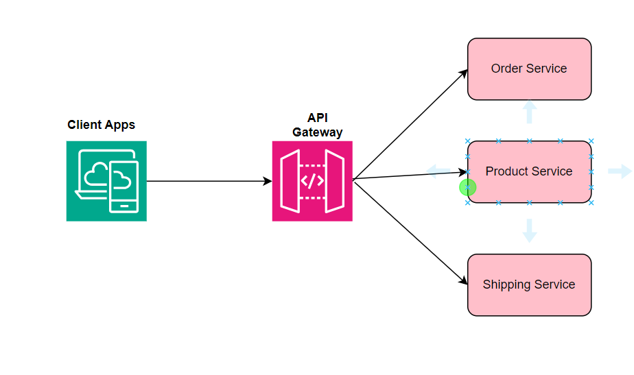
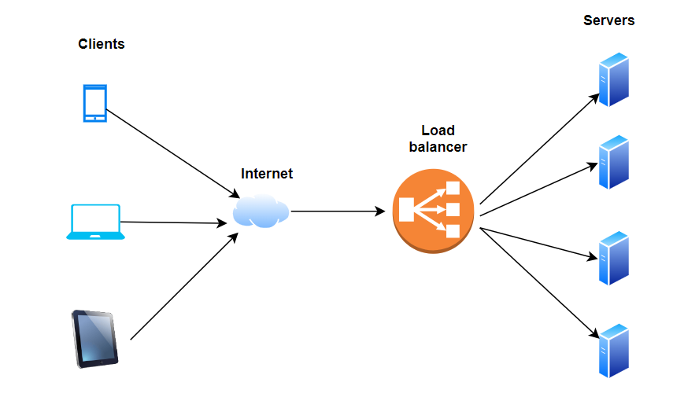
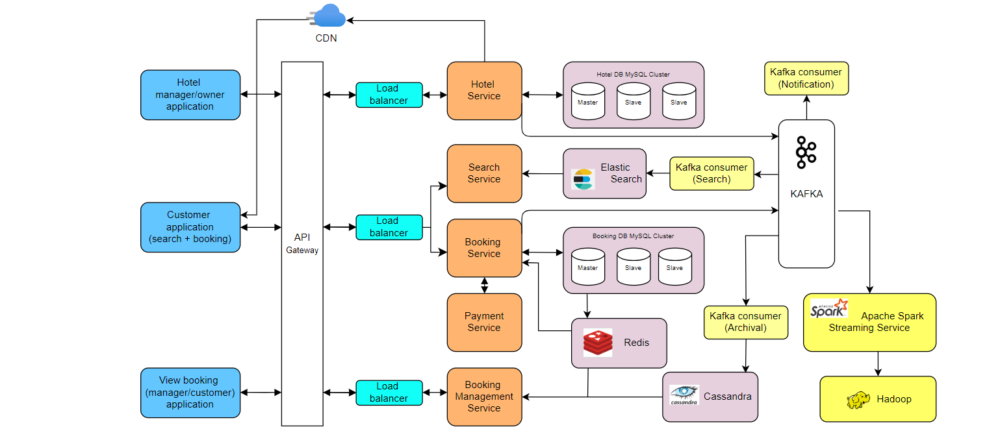

# system-design-concepts

### Load balancer vs API gateway
Both load balancer and API gateway are essential components of web infrastructure architecture. There are some key differences between them for managing the traffic coming to an application.

**API Gateway:** It is a single entry point for all API requests from clients to various backend services(microservices, databases, functions etc). The main purpose of API gateway is to provide a secure and consistent access layer for client applications. There are some other main functions of it,

1. **Rate limiting:** Limits the number of requests that can be made within a certain time period.
2. **Authentication:** Authenticates the incoming requests by verifying the user has access to those resources or not.
3. **Authorization:** Provides the user permission to access a specific resource or function.
4. **Monitoring and Logging:** It provides basic monitoring for all APIs and be able to track requests, their response times, and service level agreements (SLAs). It can also log API requests and responses, which will be helpfull with troubleshooting, debugging, and auditing.

For example, API gateway provides single point of entry for all the services(Product catalog, orders, shipping, payment etc) in an eCommerce webiste.

**Load balancer:**
A load balancer is a hardware or software solution that distributes incoming traffic across multiple servers or resources. The main purpose of load balancer is to reducer the load between two or more servers. It provides some more functionalities,

1. **HTTP Compression:** Compresses web resources to reduce the amount of data sent over the network.
2. **SSL offloading:** Manages the encryption/decryption of HTTPs traffic.
3. **Caching:** It stores the frequently accessed content in a cache for quick retrieval.

### Proxy vs Reverse Proxy
### Consistent Hashing
Consistent hashing is a distributed hashing technique to achieve load balancing and minimize the need for rehashing when the number of nodes in a system changes(i.e, adding or removing nodes).

### CAP Theorem

### 1. URL Shortning service:

A URL shortener service is used to generate a short URL/aliases when user enters a long URL. Along with that, when user click on the short URL, it should redirected to original URL. 

### 2. Hotel Booking service:

The hotel booking system design is split into 3 major services,

  1. Hotel management service
  2. Customer service with search and booking capabilities
  3. View booking service

### 3. Amazon ecommerce system design:

#### Functional Requirements:
1. Implement Search functionality with a delivery ETA
2. Support a Catalog of products along with recommendations
3. Implement Cart and WishList features
4. Handling Payment flow
5. View Order history
   
#### Non-functional Requirements:
1. Low latency
2. High availability
3. High consistency

The High Level design is broadly categorized into two parts,

1. Home or Search flow 
2. Purchase or Checkout flow

### 4. WhatsApp system design:

Whatsapp is a chat application that provides instant messaging services to its users spread across the globe. The mobile application has 2.7 billion active users worldwide, with 100 billion messages & 100 million voice calls per day. It is also available in web.

#### Functional Requirements:
1. Should support One to One chat
2. Group chat with a max limit of 1024 members
3. Support file sharing with images or videos apart from plain text messages
4. Provides Sent, Delivered and Read receipt
5. Show Last seen time

#### Non-functional Requirements:
1. Low latency
2. High availability
3. Should be Scalable and efficient

### 6. Uber system design:
   
This is a Uber like **ride-hailing** service that connect riders with drivers who offer transportation services in their personal vehicles. This design is also applcable to other similar platforms like lyft, grab and ola cabs.
   
#### 1. Requirements
The system should meet the following requirements:
##### 1.1 Functional Requirements:
There are two types of users in this design: Customer(Riders) and Drivers

**Customers/Riders:** 
1. Customers should be able to see all the available cabs (based on start & destination entered) in their vicinity with an ETA and pricing details.
2. Customers should book a cab for their destination.
3. Customer should be able to see the location of the driver. i.e, Location tracking.
4. Customers should be able to cancel their booking before the ride starts.
   
**Drivers:**
1. Drivers should be able to accept or deny the ride request of customer.
2. Upon accepting the ride, the driver should be able to see the pickup location of the customer.
3. Drivers should be able to mark the ride as complete on reaching the destination.
   
##### 1.2 Non-functional Requirements:

1. Globally available across the regions
2. Low latency for ride matching
3. High availability without a down-time
4. High consistency in ride matching to prevent assigning multiple rides simultaneously for any driver.
5. Highly scalable, especially during peak hours or special events.

#### Capacity estimations

### 7. Twitter system design
Twitter is a social media service where users can read or post short messages, images, videos, GIFs, and polls in posts known as tweets. It is available on the web and mobile platforms such as Android and iOS.

#### 1. Requirements
The system should meet the following requirements:
##### 1.1 Functional Requirements:
1. User should be able to post new tweets
2. User should be able to follow other users.
3. User should have a newsfeed feature consisting of tweets from people the user is following.
4. User should be able to search tweets.

##### Extended (Or Out Of Scope) Requirements:
1. Support metrices and analytics
2. Retweet, like, comment and share functionality

##### 1.2 Non-functional Requirements:
1. Should be highly available with minimum latency.
2. Should be highly scalable and efficient.
   
#### 2. Capacity estimations
The system capacity requires analysis on daily click rate.

##### 2.1 Traffic:
Let's assume there are 1 billion users with 200 million daily active users(DAU) and each user tweets 5 times a day. This results into 1 billion tweets.

  **200 million * 5 times a day = 1 billion tweets/day**

Since the tweets also contain media files(images, videos etc), let's assume there will be 10 percent of media files shared by users. This gives us 100 million additional files to store.

  **1 billion * 10 percent = 100 million files/day**

As a result, 1 billion tweets per day translate into 12K requests per second. This is called as System Requests Per Second(RPS).

##### 2.2 Storage:

Let's assume each message is taking about 100 bytes. We need about 100GB of storage per day.

  **1 billion * 100 bytes = 100 GB/day**

Since there are 10 percent of media files(i.e, 100 million) and assume each file takes 100KB store, it requires 10TB per day additional storage.

  **100 million * 100KB = 10 TB/day**

That means, we need 10.1TB storage per day, and it requires about **37 PB** for 10 years.

  **10.1TB * 365 * 10 = 37 PB/day**

##### 2.3 Bandwidth:
The system is going to handle 10.1TB of ingress per day, we need minimum bandwidth of 120MB per second.

**High-level estimates**
Based on the above calculations, the high-level estimations are:

| Type                               | Estimation        |
| ---------------------------------- | ----------------- |
| User base: Daily Active Users(DAU) | 200 million       |
| Total tweets                       | 1 billion per day |
| Requests Per Second(RPS)           | 12K/s    |
| Storage per day                    | ~10.1 TB          |
| Storage per 10 years               | ~37 PB            |
| Bandwidth                          | 120MB/s |

